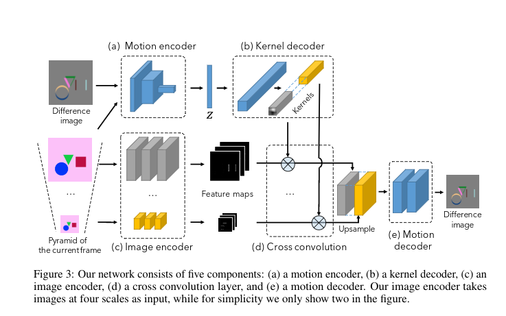

# Visual Dynamics: Probabilistic Future Frame Synthesis via Cross Convolutional Networks

NIPS 2016 (Oral)| [1607.02586](https://arxiv.org/abs/1607.02586)

Xue T, Wu J, Bouman K, Freeman W (MIT)

## Notes

* Tries to generate the next frame (raw pixel values) from the current frame.
* Actually it models the difference between two neighboring frames.
* It uses the VAE framework to do so.
* It introduces a Cross Convolutinal Layer which is not anything speciall.
* It breaks down the input image into 32 regions (not exactly, because the image is tranformed into 32 feature maps not regions, but the author used this language in his oral presentation) where each region is moved independently with a convolutional operation. The kernels of those convolutions are estimated from the _z_ value of the encoder network.
* The image encoder gets as input a pyramid (4 levels) of the input image.
* The motion decoder regresses the "difference image".
* The motion encoder sees both the difference image and the first frame.
* Input size is 128x128.
* At test time the _z_ is not actually sampled from a gaussian but from "an empirical distribution of _z_ over all training samples as an approximation to the prior" (I assumed that is a parzen window)

## Cons

* The _z_ dimension is very large i.e 3200! They show as part of their results that
* Only the next frame:
* Only simple dataset:
* Only simple motion

## Ideas

* What about MPEG?
